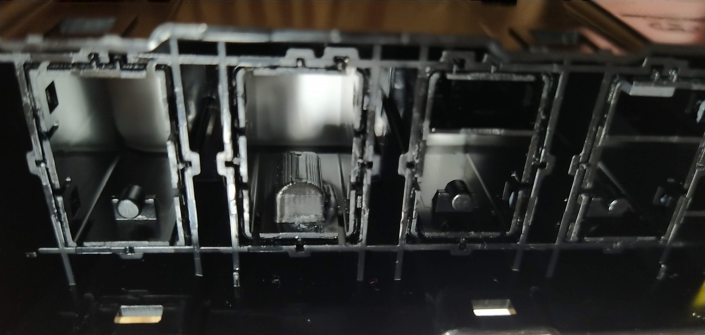

# Kia_Niro_VESS_Mod

This repository captures notes on modifications which could be made to the _Crash
pad_ to expose the Virtual Engine Sound System (VESS) silencing functionality present
within the 2020 Kia Niro EV in a manner that appears stock.

Performing these steps on your own vehicle could lead to damage or injury. Consult
your favorite mechanic, doctor, and lawyer before proceeding.  

_Don't do this at home._  

# Why

The 2020 Kia Niro has a speaker at the front of the vehicle that plays a _futuristic_
noise when the car is traveling below ~25mph and an obnoxiously loud beeping noise when
the vehicle is in reverse.

Sometimes it's undesirable to play these noises, specifically the obnoxiously loud reverse beep
  * it's 3am and you don't want to wake the neighborhood
  * you're parallel parking and don't need the whole city street alerted to this fact
  * You don't want to make the person in front of you have ear-bleeds as you leave your parking
    space at the grocery store.

The crash pad wiring harness pinout was made available on various forums online. Astute observers
noticed that [the conductors at pins 9 and 10](https://www.kianiroforum.com/threads/2020-e-niro-reverse-chime-defeat-for-us-cars.9643/#post-90682)
in the _Crash Pad Switch_ wiring harness (M26) were labeled `VESS Unit (VESS Switch)`
and `VESS Unit (VESS IND)` respectively. Momentarily connecting `VESS Switch (9)` to ground
will cause the the VESS to stop making noise. Pressing it again will re-enable the VESS
sounds. This setting does not persist through the car being turned on/off.

So the car already comes with the ability to disable this obnoxious feature. It's 
apparently even shipped with a button to do so in other markets:
  

Since this is a relatively simple modification to make, there are many people
installing panel mount momentary switches onto their fuse panel cover,
or adjacent plastics. I actually bought the parts to perform the installation
[this way](https://www.kianiroforum.com/threads/2020-e-niro-reverse-chime-defeat-for-us-cars.9643/page-2#post-91750).

    
  

On my vehicle, the crash pad has an unused position on the button assembly.
At least in some models/trims this appears to be populated with a button labeled
`12V battery reset`. I have a base model full EV version of the vehicle. So this
button is just blank and does not move when pressed.

Some have even installed aftermarket switches at this location:
.

While taking the car apart, I got curious what was inside the button assembly, and
if the blanked position could be converted to a functional button that could turn
the VESS  on/off.

# Materials

  * Momentary switch:  
    * E-Switch [TL9210AF260Q](https://octopart.com/tl9210af260q-e-switch-48634244?r=sp)  
      Other parts in the TL9210 family will also likely work fine, but will require a different amount of force to depress.
      
      The TL9210AF260Q seems to be of comparable force to the stock switches, and the exact same dimensions.
      
      If these are not available in the future, something with dimensions close to this should be sourced:
      

      Critical dimensions are the pad locations as well as the height of the and stroke
      of the actuator. There is otherwise plenty of room surrounding the switch within the
      assembly and on the PCB.
  * Philips head screw driver
  * Plastic, non-marking, pry tools.
  * Soldering iron & solder
  * Exacto knife
  * 3D printer (optional)

# Links

  * [Wiring harness schematic and crash pad panel access steps](https://www.kianiroforum.com/threads/2020-e-niro-reverse-chime-defeat-for-us-cars.9643/) and disable button installations
  * [Another thread of VESS button installations](https://www.insideevsforum.com/community/index.php?threads/2020-kia-e-niro-vess-reverse-chime-defeat-solution.11245/)
  * VESS Disassembly and reverse engineering:
    * [git project](https://github.com/hughsie/mobis-vess)
    * [Control VESS over CAN](https://www.youtube.com/watch?v=OLT1aKdpYhs) youtube video

# Crash pad modifications

The following steps were performed:
  * Remove button assembly from vehicle & access the PCB
  * Install a momentary switch on the PCB
  * Make the blank button position functional

## Remove button assembly from vehicle & access the PCB
  * Follow the steps [here](https://www.kianiroforum.com/threads/2020-e-niro-reverse-chime-defeat-for-us-cars.9643/)
    to access the crash pad button assembly from the vehicle.

  * Disconnect the wiring harness from the rear of the assembly.
    
    

  * Unscrew the bezel from the button assembly.
      
    

  * Wedge pry tools along the rear sides of the button assembly to rear of the button assembly.
    

  * Use pry tools to remove the PCB from the plastic carrier.

## Install a momentary switch on the PCB

    
    _The pins for the wire harness connector is nice and accessible from the side!_

    

If your vehicle is like mine, it will have nothing populated at the "SW4" location
(I didn't get a good photo of my PCB before I modified the PCB).

We need to actually install a momentary switch on the PCB, and then do a little
wire routing to make this switch hook into the VESS pins on the wiring harness.

I used a meter to trace out where SW4 was wired to on the harness. One side of
the switch goes to unpopulated pads that would presumably have some passives to
tie it back to ground. The other side goes to a pin on the wire harness connector.

* Solder the new momentary switch onto the pads at `SW4`
  Ensure the component is lying flush against the PCB.  

  

* Wire one side of the switch to ground  
  

* Wire the other side of the switch to the `VESS SWITCH` signal (pin 9).  
  

* Disconnect the switch from it's stock signal pin on the wire harness by
  severing the trace on the PCB.

  

  You should be able to cut two straight lines across the trace pictured with
  an exacto knife. Then peel the copper between the cuts away with the tip of the blade.  
  __Go slow. Use magnification as needed.__

## Make the blank button position functional

__TODO: Add images and steps for cutting down sides of button so it can slide__

When you press the stock buttons on the crash pad, you're actually depressing the
surface mount momentary switches on the PCB. The surface mount switch's internal
spring action is what causes the button to pop back out. 

The stock, blank button, doesn't have a feature which will push against the
button we've installed on the PCB (it's empty inside).

I designed:
  * a part that I could glue to the interior of the switch blank so that
    it can contact the surface mount button on the PCB. It's called the pusher block...
    cause it's a block that pushes... yes it is a creative name.
  * and a tool ("install tool") that will aid placing the pusher block in the right
    location inside the switch blank.

    

If you don't have access to a 3d printer, you could make a rectangular
block out of plastic/metal/wood/etc instead. This isn't rocket surgery. You just
need to affix it to the inside of the button blank at the right distance away 
from the button on the PCB.  
You want to recess the face of the block __~3mm__ from the back edge of the switch. 

* Print a copy of the two 3d printed parts in this repo.  
  * [Pusher block (stl)](./3dprints/pusher%20block.stl)  
  * [Install tool (stl)](./3dprints/install_Tool.stl)  

  Source CAD can be found [here](https://cad.onshape.com/documents/8f00413ce9ee36bdaab39628).

* Place the pusher block into the install tool.
  The curved face of the block should face into the crade of the tool.
* Place super glue (CA) on the flat bottom surface of the pusher block
* Use the install tool to insert the pusher block into the switch blank
  
  

* Hold in place while glue dries
* Remove the install tool

  